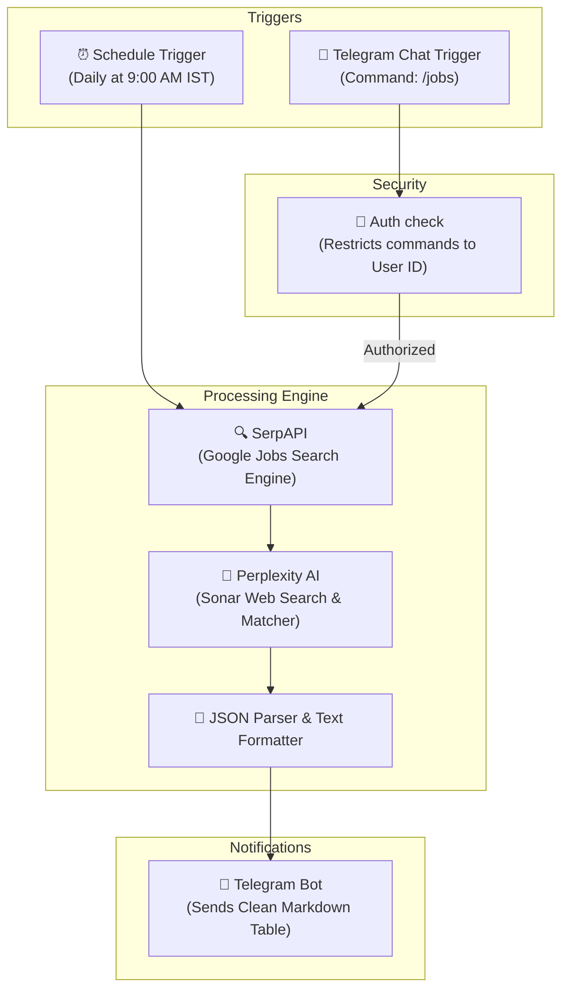

# AI-Powered DevOps Job Search Automation Bot

A low-code automation system built on **n8n**, **SerpAPI**, and **Perplexity AI** that automatically aggregates, filters, and qualifies entry/mid-level Cloud & DevOps roles, delivering a curated shortlist straight to your personal **Telegram Bot** daily and on-demand.

---

## 🏗️ Architecture Flow



---

## ✨ Features

- 🕐 **Scheduled Runs:** Runs autonomously every day at 9:00 AM IST to keep you updated.
- 💬 **On-Demand Requests:** Send `/jobs` to your Telegram bot anytime to trigger a real-time, on-demand search.
- 📍 **Multi-Location Focus:** Targets jobs specifically in **Chennai**, **Bangalore (Bengaluru)**, and **Remote opportunities** open to India.
- 🎯 **AI Filtering & Scoring (Perplexity AI):** 
  - Filters out mismatched locations (Poland, USA, Europe, etc.).
  - Filters out overly senior roles (5+ years, Lead, Staff, Principal).
  - Welcomes entry-to-mid level roles (0-4 years).
  - Matches jobs specifically against candidate skills (AWS, EKS, Terraform, CI/CD, Scripting).
- 🏆 **Company Prioritization:** Gives higher weighting and visibility to well-known companies, MNCs, and famous startups (e.g., Zoho, Freshworks, Accenture, Cognizant, etc.).
- 🔒 **Private & Secure:** Only responds when triggered by your unique Telegram User ID (keeps other users from triggering API charges).

---

## 🛠️ Tech Stack & Services Used

* **Orchestration:** [n8n](https://n8n.io/) (Self-Hosted via Docker)
* **Job Data Aggregator:** [SerpAPI](https://serpapi.com/) (Google Jobs API - 100 free requests/month)
* **AI Analysis:** [Perplexity API](https://www.perplexity.ai/) (Sonar Online model for live web lookup & reasoning)
* **Delivery Channel:** [Telegram Bot API](https://core.telegram.org/bots)

---

## 🚀 Getting Started

### 1. Prerequisites
You will need the following API tokens:
1. **Telegram Bot Token:** Created via [@BotFather](https://t.me/BotFather) on Telegram.
2. **SerpAPI Key:** Get a free account at [serpapi.com](https://serpapi.com) (no credit card required).
3. **Perplexity API Key:** Get your token from your [Perplexity settings dashboard](https://www.perplexity.ai/settings/api).

### 2. Run n8n locally (Docker)
Run the following command to spin up n8n with an HTTPS webhook tunnel (replace the URL with your Cloudflare Tunnel or ngrok endpoint):
```bash
docker run -d --name n8n \
  -p 5678:5678 \
  -e GENERIC_TIMEZONE="Asia/Kolkata" \
  -e WEBHOOK_URL="https://your-secure-tunnel-url.trycloudflare.com/" \
  -v n8n_data:/home/node/.n8n \
  --restart unless-stopped \
  n8nio/n8n
```

### 3. Import the Workflow
1. Copy the contents of the `workflow.json` file in this repository.
2. Open your n8n workspace at `http://localhost:5678`.
3. Create a **New Workflow**.
4. Press `Ctrl + V` (Windows) or `Cmd + V` (Mac) to paste the entire visual builder node layout.

### 4. Configuration Steps
- **Telegram Nodes:** Select your Telegram API credentials in the dropdown menu.
- **Perplexity Node:** Configure HTTP Header Authentication with your Perplexity Bearer Token.
- **Auth Check Node:** Update the check value to match your personal Telegram User ID (obtained by messaging `@userinfobot` on Telegram).
- **SerpAPI Node:** Replace `YOUR_SERPAPI_KEY` under the query parameters with your actual SerpAPI key.
- Save and turn the **Active** toggle to **ON**.

---

## 📊 Sample Output in Telegram

🚀 **DevOps & Cloud Jobs Shortlist** — 19/07/2026

| Job Title | Company | Location | Apply Link | Why it Fits |
| :--- | :--- | :--- | :--- | :--- |
| Cloud DevOps Engineer | Freshworks | Bangalore | [Apply](https://example.com/apply) | AWS/Kubernetes stack match |
| Platform Engineer | Zoho | Chennai | [Apply](https://example.com/apply) | Terraform & EKS alignment |

🏆 **Top Picks for You**
* **Freshworks** - Excellent match for your AWS/EKS/Terraform skills with a 2-4 year experience range.
* **Zoho** - Good candidate profile match prioritizing your Jenkins multibranch pipeline optimization achievements.

---

## 📄 License
This project is licensed under the MIT License.
